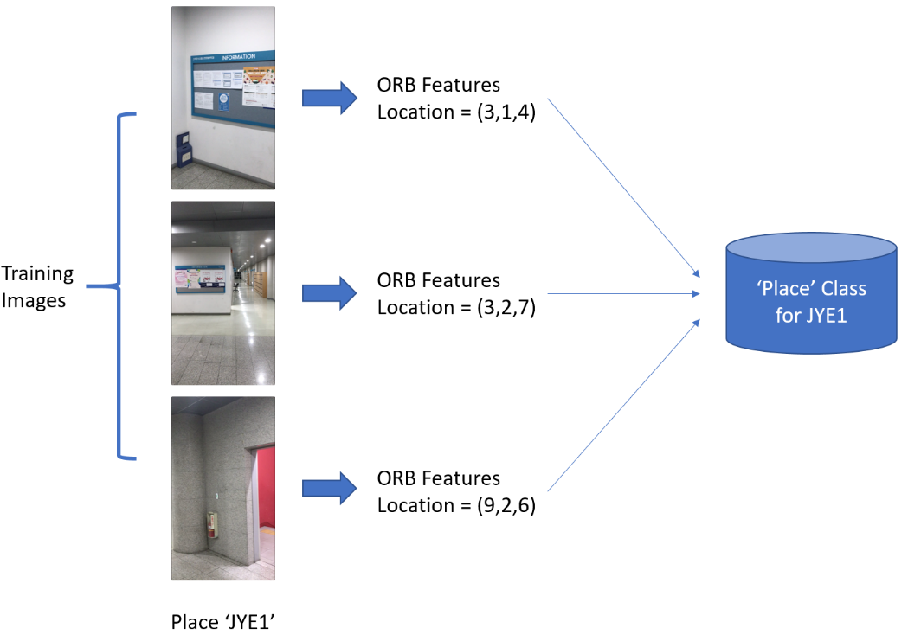
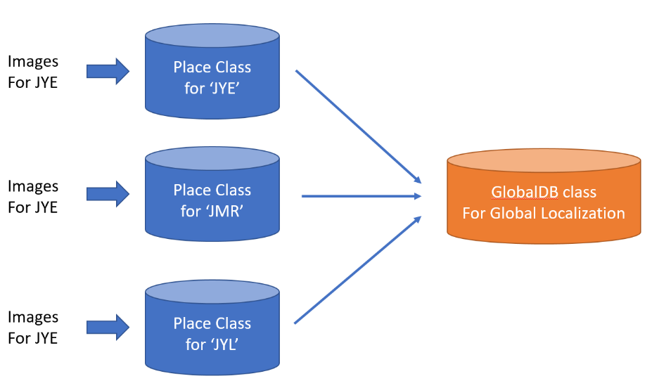
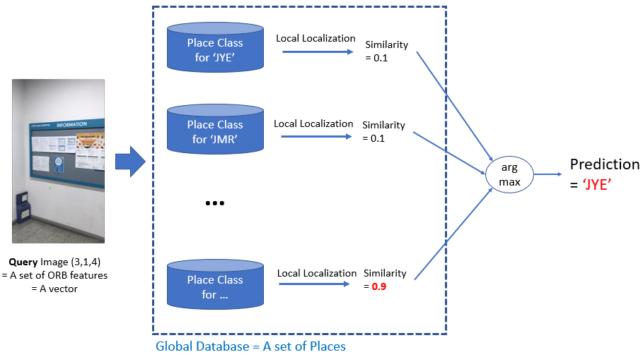
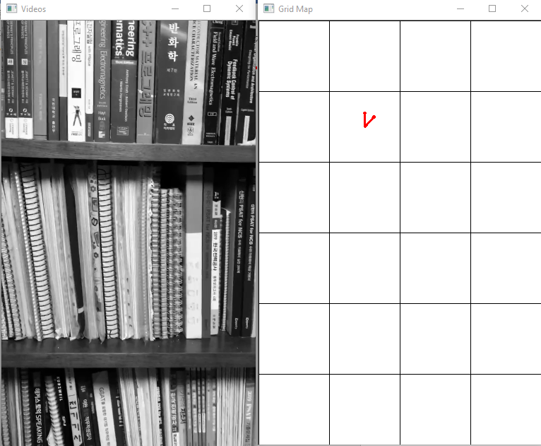

### Image-based localizer given maps and their corresponding images
This project aims to develop an geo-tagged image-based localizer which works in indoor environments. Since this depends only on geo-tagged images, it works well even without additional sensors such as GPS. There are three steps: database preparation, global localization, and local localization. In the first step, images are geo-tagged using the simplified versions of real maps and ORB (Oriented FAST and Rotated BREIF) features of them are extracted. These extracted features constitute an image database.  In the next step, the program localizes where a user is globally using the image database. For instance, when the user is in the 1st floor of a library and take a photo of his surroundings (a query image), the program extracts ORB features from the query image to select the most similar photos from the database. Since all images of the database have been geo-tagged already, the localizer can let the user know their location as well as orientation globally (ex. The user is in a library and the location is (3,4), etc.). In the last step, after the global localization, it updates the user’s location in the place whenever more photos of it are fed into the localizer. For instance, the user can track of their pose (location and heading direction) in the 1st floor of the library. In the last part of the paper, even though this project is not assumed to be applied for videos, it shows the possibility of video localization as well. 

 Construct a database for a single place 

 Combining databases of different places into a global database 

 Localization (query) process 

 Video Localization result (You can see the coordinates) 

